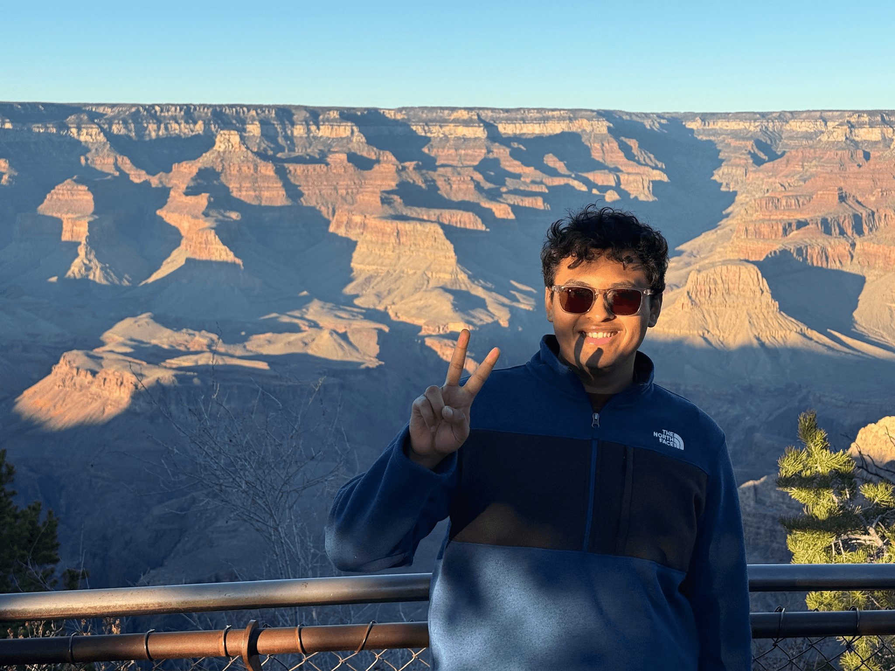

<!-- STICKY HOVERING FLOATING GLASS NAV BAR WITH MOBILE DROP DOWN -->

    
Akshaj Murhekar

    
    <!-- Hidden Checkbox & Hamburger Label for Mobile Toggle -->
    <input type="checkbox" id="nav-toggle" class="nav-toggle">
    <label for="nav-toggle" class="nav-toggle-label">
        
        
        
    </label>

    

        <a href="#about">About</a>
        <a href="#research">Research</a>
        <a href="#education">Education</a>
        <a href="#projects">Projects</a>
        <a href="#awards">Awards</a>
        <a href="#ta">TA & Mentoring</a>
    

<!-- INTRO & INTERESTS BLOCK: Headshot Left Column with Links underneath / Content Right Column -->

    
    <!-- Left Column: Centered Image & Contact Links (Inspired by Screenshot 2026-06-15 at 2.38.53 PM.jpg) -->
    

        
        
        <!-- Clean Row of Normalized Favicons from your local assets -->
        

            <!-- Google Scholar -->
            

            <!-- LinkedIn -->
            

            <!-- GitHub -->
            

            <!-- Document / CV (Placeholder link) -->
            
        

        
        <!-- Email Link Block with Normalized Envelope Favicon -->
        

            
            <a href="mailto:akshaj.murhekar@utexas.edu" style="font-weight: 500; color: #0366d6; text-decoration: none;">akshaj.murhekar@utexas.edu</a>
        

    

    <!-- Right Column: Bio Paragraph & Research Interests -->
    

        

            I am a graduate researcher at UT Austin with a focus on language modeling, representation learning, and multimodal deep learning. During my time as an M.S. student, I worked with <a href="https://abhijitmishra.github.io/" target="_blank">Dr. Abhijit Mishra</a> on challenging problems at the intersection of language models and neural signal processing. My research focused on leveraging in-context learning capabilities of Large Language Models (LLMs). Specifically, I developed privacy-preserving neuro-symbolic decoding pipelines and efficient retrieval frameworks designed to bridge the gap between brain activity and text, translating electroencephalography (EEG) signals directly into natural language. Please bear with me while I wait for Google Search to index this page.
        

        <h3 style="font-size: 1.15em; font-weight: 600; color: #24292f; margin-bottom: 10px;">Research Interests</h3>
        <ul style="line-height: 1.7; padding-left: 20px; color: #24292f; margin: 0;">
            <li style="margin-bottom: 4px;"><strong>Multimodal Deep Learning</strong></li>
            <li style="margin-bottom: 4px;"><strong>Neuro-Symbolic Learning</strong></li>
            <li style="margin-bottom: 4px;"><strong>Sparse & Efficient Architectures</strong></li>
            <li style="margin-bottom: 4px;"><strong>LLM Evaluation & Behavioral Alignment</strong></li>
        </ul>
    

## Research & Preprints {#research}

<ol style="padding-left: 20px; margin: 0;">
    <!-- PUBLICATION 1 -->
    <li style="margin-bottom: 28px; line-height: 1.6; color: #24292f;">
        

            SYNAPSE: Neuro-Symbolic Visual Thought-to-Text Decoding via Topological Semantic Denoising
        

        

            <strong>A. Murhekar</strong>, A. Mishra. (2026). <em>Under review at EMNLP 2026</em>.
        

        

            <a href="https://arxiv.org/abs/2605.27790" target="_blank" style="padding: 4px 10px; background-color: #f1f2f4; color: #0366d6; border-radius: 6px; text-decoration: none; font-weight: 500; border: 1px solid #e1e4e8;">arXiv Abstract</a>
            <a href="https://arxiv.org/pdf/2605.27790.pdf" target="_blank" style="padding: 4px 10px; background-color: #f1f2f4; color: #0366d6; border-radius: 6px; text-decoration: none; font-weight: 500; border: 1px solid #e1e4e8;">PDF</a>
            <a href="https://github.com/akshaj-utexas/neuro-symbolic-eeg-to-text" target="_blank" style="padding: 4px 10px; background-color: #f1f2f4; color: #0366d6; border-radius: 6px; text-decoration: none; font-weight: 500; border: 1px solid #e1e4e8;">Code</a>
        

    </li>

    <!-- PUBLICATION 2 -->
    <li style="margin-bottom: 28px; line-height: 1.6; color: #24292f;">
        

            SENSE: Efficient EEG-to-Text via Privacy-Preserving Semantic Retrieval
        

        

            <strong>A. Murhekar</strong>, C. Liu, A. Mishra, S. Roychowdhury, J. Gwizdka. (2026). <em>Under review at ICMI 2026</em>.
        

        

            <a href="https://arxiv.org/abs/2603.17109" target="_blank" style="padding: 4px 10px; background-color: #f1f2f4; color: #0366d6; border-radius: 6px; text-decoration: none; font-weight: 500; border: 1px solid #e1e4e8;">arXiv Abstract</a>
            <a href="https://arxiv.org/pdf/2603.17109.pdf" target="_blank" style="padding: 4px 10px; background-color: #f1f2f4; color: #0366d6; border-radius: 6px; text-decoration: none; font-weight: 500; border: 1px solid #e1e4e8;">PDF</a>
            <a href="https://github.com/akshaj-utexas/efficient-eeg-2-text" target="_blank" style="padding: 4px 10px; background-color: #f1f2f4; color: #0366d6; border-radius: 6px; text-decoration: none; font-weight: 500; border: 1px solid #e1e4e8;">Code</a>
        

    </li>

    <!-- PUBLICATION 3 -->
    <li style="margin-bottom: 28px; line-height: 1.6; color: #24292f;">
        

            A Survey on Bridging EEG Signals and Generative AI
        

        

            S. Shukla, J. Torres, <strong>A. Murhekar</strong>, C. Liu, A. Mishra, J. Gwizdka, S. Roychowdhury. (2025). <em>Under review at Neural Networks (Elsevier)</em>.
        

        

            <a href="https://arxiv.org/abs/2502.12048" target="_blank" style="padding: 4px 10px; background-color: #f1f2f4; color: #0366d6; border-radius: 6px; text-decoration: none; font-weight: 500; border: 1px solid #e1e4e8;">arXiv Abstract</a>
            <a href="https://arxiv.org/pdf/2502.12048.pdf" target="_blank" style="padding: 4px 10px; background-color: #f1f2f4; color: #0366d6; border-radius: 6px; text-decoration: none; font-weight: 500; border: 1px solid #e1e4e8;">PDF</a>
        

    </li>
</ol>

## Education {#education}

<!-- UT AUSTIN ENTRY -->

    

        
    

    

        

            The University of Texas at Austin
            2024 &ndash; 2026
        

        

            M.S. in Information Science (Thesis Track)
        

        

            <strong>Specialization:</strong> Applied Machine Learning and Deep Learning
        

        

            <strong>Committee:</strong> 
            <a href="https://abhijitmishra.github.io/" target="_blank">Dr. Abhijit Mishra</a>, 
            <a href="https://ischool.utexas.edu/profiles/shounak-roychowdhury" target="_blank">Dr. Shounak Roychowdhury</a>, 
            <a href="https://jacekg.ischool.utexas.edu" target="_blank">Dr. Jacek Gwizdka</a>
        

    

<!-- UT ARLINGTON ENTRY -->

    

        
    

    

        

            The University of Texas at Arlington
            2020 &ndash; 2024
        

        

            B.S. in Computer Science
        

        

            <strong>Honors:</strong> Presidential Scholarship (Full-Tuition Merit Award &middot; $108,000)
        

        

            <strong>Senior Design:</strong> Autonomous Medical Supply Cart (NIH-Funded &middot; Presented at <a href="https://2023bmesannual.eventscribe.net/fsPopup.asp?PresenterID=1526288&mode=posterPresenterInfo" target="_blank" style="color: #0366d6; text-decoration: none; font-weight: 500;">BMES 2023</a>)
        

    

## Selected Projects {#projects}

<ul style="line-height: 1.7; padding-left: 20px; color: #24292f; margin-bottom: 35px;">
    <li style="margin-bottom: 8px;">
        <strong>Scientific Sycophancy Benchmark:</strong> Engineered an evaluation pipeline uncovering an 85% failure rate where frontier LLMs prioritize helpfulness over physical laws, motivating a verification-aware RAG framework.
    </li>
    <li style="margin-bottom: 8px;">
        <strong>KV Cache Optimization:</strong> Engineered a PyTorch-based algorithm to reduce Llama-3 system memory usage by 50% during inference.
    </li>
    <li style="margin-bottom: 8px;">
        <strong>Audio-Visual Source Separation:</strong> Architected a U-Net with visual conditioning to separate target audio sources from mixtures via latent space modulation.
    </li>
    <li style="margin-bottom: 8px;">
        <strong>LLM Fine-tuning (Review Feedback):</strong> Fine-tuned Qwen2.5-1.5B using PEFT and Unsloth on a 46M-token synthetic dataset for high-throughput inference.
    </li>
</ul>

## Awards, Grants & Recognitions {#awards}

<ul style="line-height: 1.7; padding-left: 20px; color: #24292f; margin-bottom: 35px;">
    <!-- Award 1 -->
    <li style="margin-bottom: 16px;">
        

            <strong>Presidential Scholarship ($108,000)</strong> &middot; UT Arlington
            2020 &ndash; 2024
        

        

            The university's premier undergraduate merit award, covering full tuition and fees for four years based on exceptional academic entry credentials.
        

    </li>
    
    <!-- Award 2 -->
    <li style="margin-bottom: 16px;">
        

            <strong>NSF REU Research Awards (2x Recipient)</strong> &middot; National Science Foundation
            2022 &ndash; 2024
        

        

            Funded undergraduate research fellowships supporting two distinct initiatives:
            <ul style="margin-top: 4px; margin-bottom: 0; padding-left: 20px; list-style-type: circle;">
                <li><strong>Assistive Robotics (2022–2023):</strong> Developed an outdoor drone navigation system for the visually impaired, which served as a foundational asset for my subsequent appointment at UT Arlington Research Institute.</li>
                <li><strong>Generative AI Systems (2023–2024):</strong> Developed an early-stage AI framework to convert raw text prompts into educational video content.</li>
            </ul>
        

    </li>

    <!-- Award 3 -->
    <li style="margin-bottom: 16px;">
        

            <strong>NIH Institutional Research Grant Funding</strong> &middot; National Institutes of Health
            2023 &ndash; 2024
        

        

            Funded a year-long Senior Design initiative where I served as the project lead. Following summer field research with medical staff to identify clinical workflow constraints, I led the full-lifecycle engineering and development of an autonomous medical supply cart, presenting our initial framework at the <a href="https://2023bmesannual.eventscribe.net/fsPopup.asp?PresenterID=1526288&mode=posterPresenterInfo" target="_blank" style="color: #0366d6; text-decoration: none; font-weight: 500;">BMES 2023</a> Annual Meeting in Seattle.
        

    </li>

    <!-- Award 4 -->
    <li style="margin-bottom: 16px;">
        

            <strong>Undergraduate Research Excellence (Rank 3)</strong> &middot; College of Engineering
            2023
        

        

            Ranked third overall across the entire College of Engineering for competitive undergraduate research project demonstrations, awarded specifically for the engineering design and execution of the assistive navigation drone system.
        

    </li>

    <!-- Award 5 -->
    <li style="margin-bottom: 8px;">
        

            <strong>Undergraduate Research Appreciation Award</strong> &middot; UT Arlington Research Institute
            2024
        

        

            Awarded by the UT Arlington Research Institute in recognition of technical contributions to institutional computer vision, photogrammetry, and robotics projects.
        

    </li>
</ul>

## Teaching Assistantships & Mentorship {#ta}

### Research Mentorship
<ul style="line-height: 1.7; padding-left: 20px; color: #24292f; margin-bottom: 24px;">
    <li style="margin-bottom: 8px;">
        <strong>Undergraduate Research Mentor</strong> &middot; UT Austin 2025 &ndash; 2026
        

            Mentored an undergraduate researcher exploring multimodal machine learning. Co-guided her through project frameworks and research methodologies, directly supporting the execution of her Honors Bachelor's Thesis tied to our core deep learning pipeline.
        

    </li>
</ul>

### Teaching & Tutoring
<ul style="line-height: 1.7; padding-left: 20px; color: #24292f; margin-bottom: 35px;">
    <li style="margin-bottom: 12px;">
        <strong>Graduate Teaching Assistant</strong> &middot; UT Austin 2025
        

            Served as a Graduate TA across distinct academic disciplines, including Statistics and Academic Writing courses. Held weekly office hours to assist students with core course material, managed evaluation frameworks, and guided students through complex coursework requirements.
        

    </li>
    <li style="margin-bottom: 8px;">
        <strong>Undergraduate Academic Tutor</strong> &middot; UT Arlington 2022 &ndash; 2024
        

            Provided high-impact 1-on-1 and drop-in academic instruction across multiple departments. Covered core Computer Science curricula (Data Structures & Algorithms, Software Engineering), advanced Mathematics (Calculus I–III, Linear Algebra), and foundational courses in Philosophy and English.
        

    </li>
</ul>

<!-- FOOTER DIVIDER LINE -->

<!-- FOOTER CONTAINER -->

    
    <!-- Left Side: Branding, UT Logo asset, and Copyright -->
    

        
        &copy; 2026 Akshaj Murhekar. All rights reserved.
    

    
    <!-- Right Side: Discreet View Counter Badge -->
    

        Views:
        <!-- Dynamic Hit Counter Badge -->
        
    

